# Surveys

An Application for creating surveys.

## Create an Account and sign in
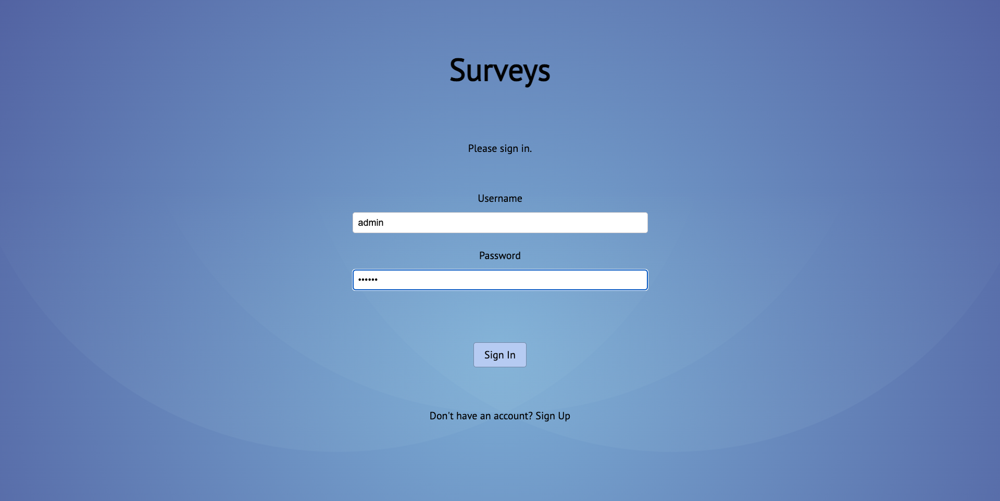
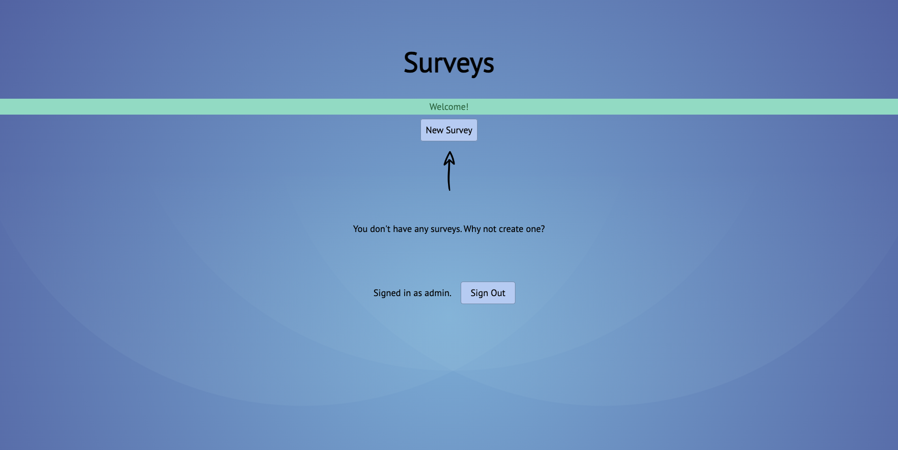

## Create a Survey
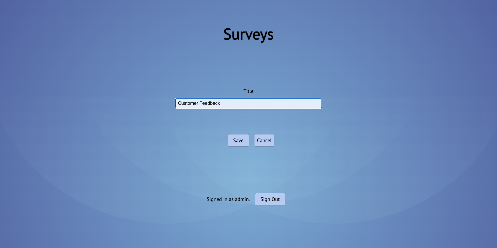
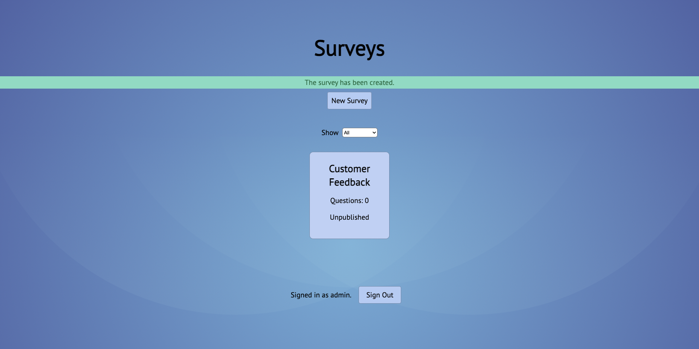

## Add questions
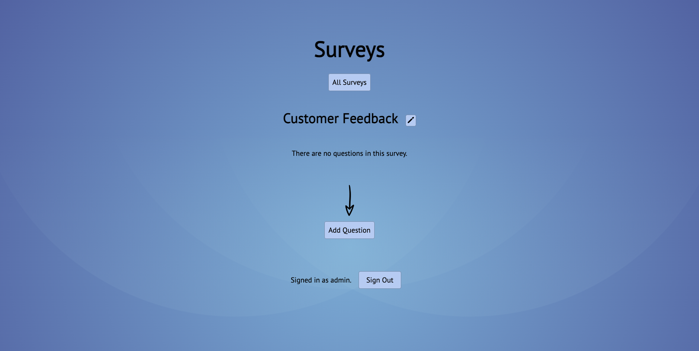
The answers can be 1 required out of multiple - "closed", 1 or more required
out of multiple - "nominal", and "write your answer" - "open".
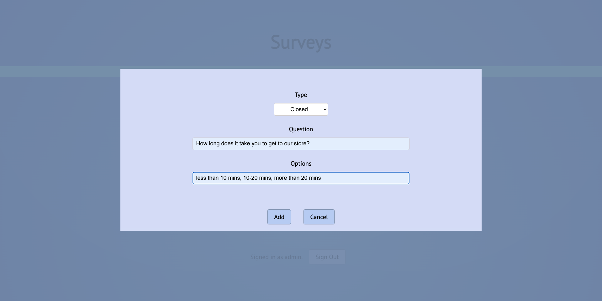
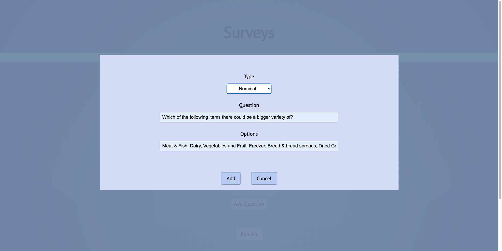
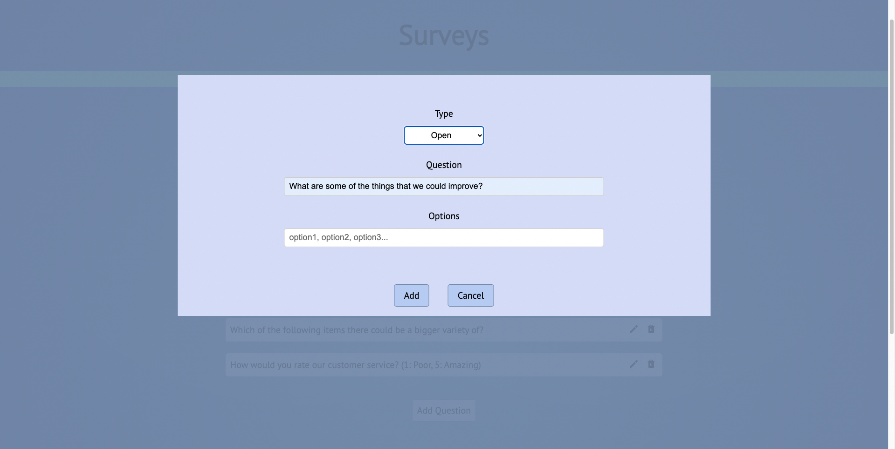
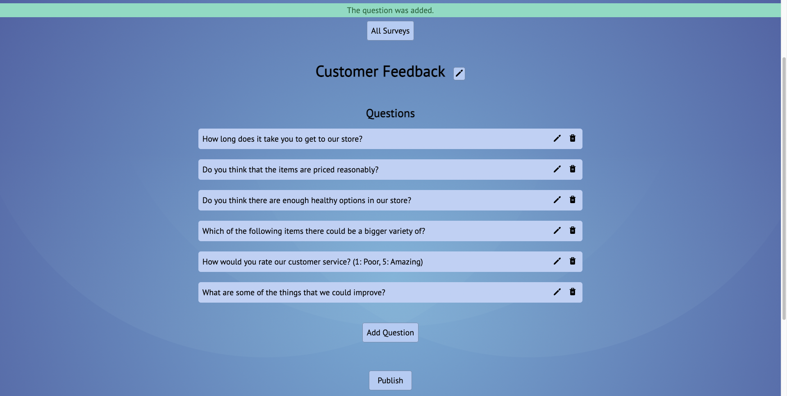

## Publish the survey
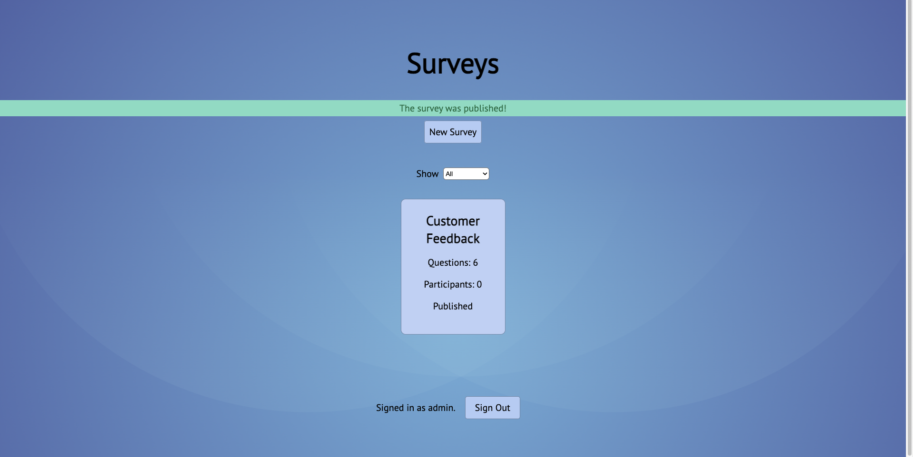

## Share the link with participants
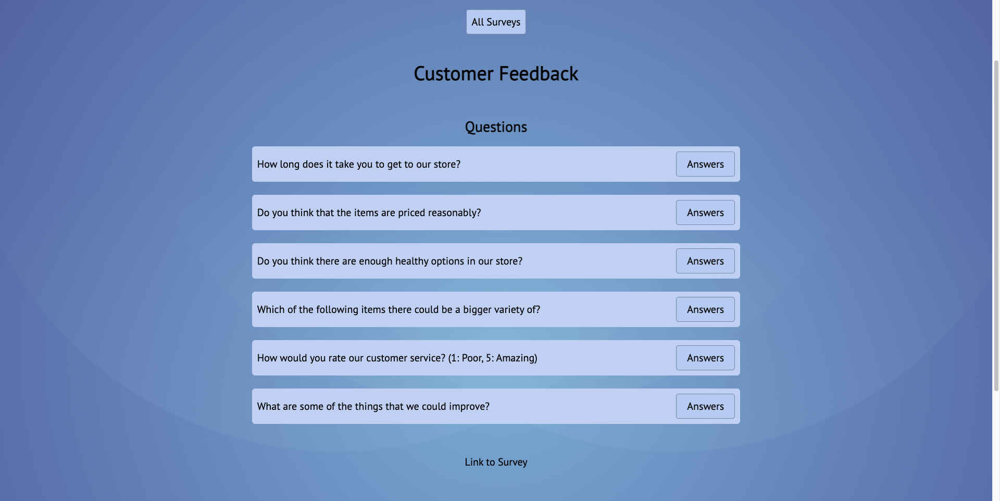

## Get the participants to complete the survey
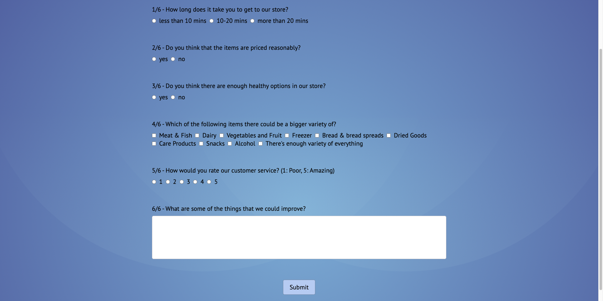

## Get statistics for the answers to each question
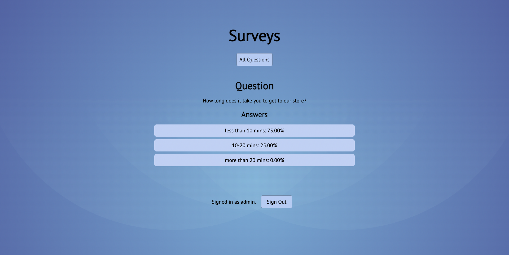
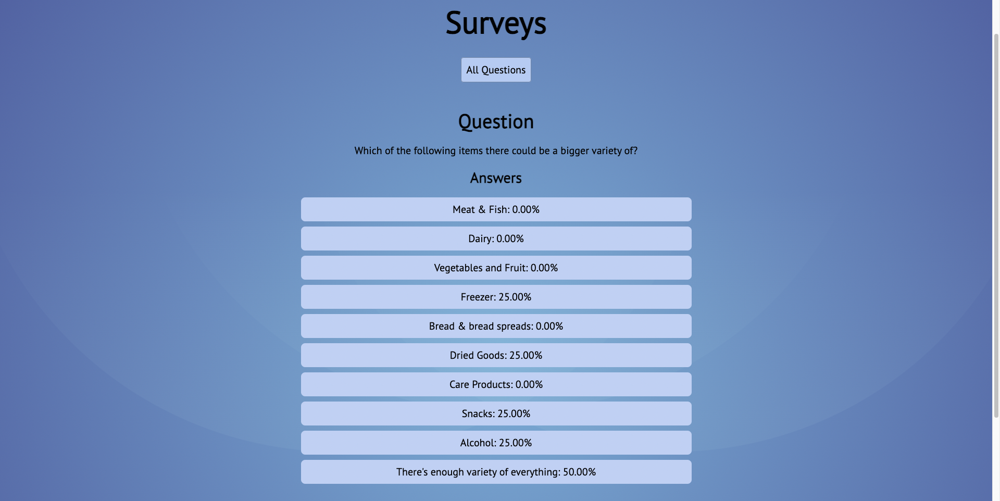
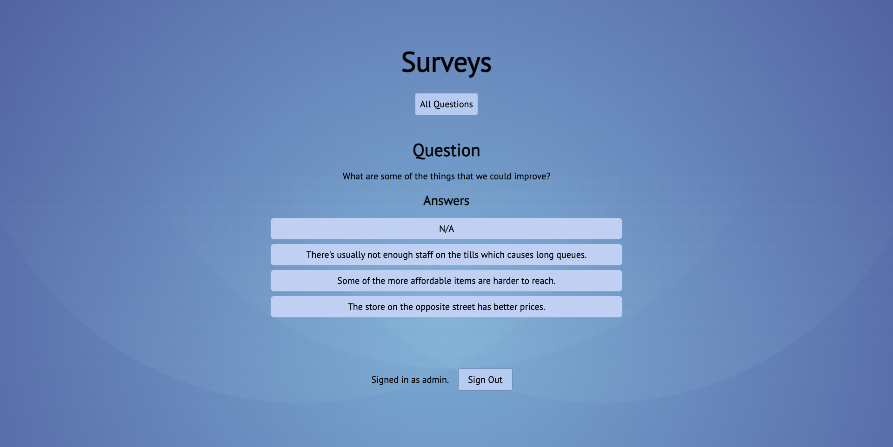
